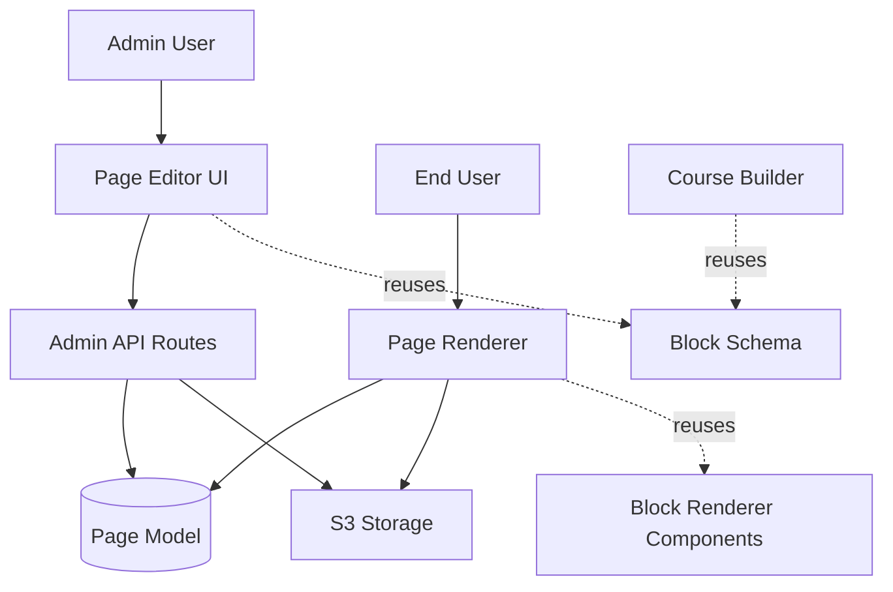

# Design Document: Admin Block-Based Page Builder

## Overview

The Admin Block-Based Page Builder extends the existing admin interface to provide a visual, drag-and-drop page editor that reuses the Course Builder's block system. This design leverages the existing Block Schema, upload infrastructure, and rendering logic to minimize new code while providing a powerful content management capability.

The solution consists of three main components:
1. **Backend API Extensions** - New admin routes for page-specific block operations
2. **Page Editor UI** - React-based interface for visual page construction
3. **Frontend Page Renderer** - Component to render block-based pages for end users

## Architecture

### System Context



### Data Flow

**Page Creation/Edit Flow:**
1. Admin navigates to page editor
2. Page Editor loads existing page data (if editing) or initializes empty page
3. Admin adds/edits/reorders blocks using visual interface
4. Changes auto-save to backend every 30 seconds
5. Admin publishes page when ready

**Page Rendering Flow:**
1. End user requests page by slug
2. Backend retrieves page from database
3. Frontend Page Renderer iterates through blocks array
4. Each block renders using existing Course Builder block components
5. Interactive blocks function identically to course lesson blocks

## Components and Interfaces

### 1. Backend API Extensions

#### New Admin Routes (src/routes/admin.ts)

```typescript
// Get page for editing (with blocks)
GET /api/admin/pages/:id/edit
Response: { page: IPage }

// Save page blocks
PUT /api/admin/pages/:id/blocks
Body: { blocks: IBlock[] }
Response: { page: IPage }

// Reorder page blocks
PATCH /api/admin/pages/:id/blocks/reorder
Body: { blockIds: string[] }
Response: { blocks: IBlock[] }

// Duplicate page block
POST /api/admin/pages/:id/blocks/:blockId/duplicate
Response: { block: IBlock }

// Delete page block
DELETE /api/admin/pages/:id/blocks/:blockId
Response: { message: string }

// Validate slug uniqueness
GET /api/admin/pages/validate-slug?slug=:slug&excludeId=:id
Response: { isUnique: boolean }
```

#### Modified Page Model

The Page model's `content` field will be updated to use a structured format:

```typescript
interface IPage extends Document {
    title: string;
    slug: string;
    content: {
        blocks: IBlock[];  // Array of blocks using Course Builder schema
        version: string;    // Schema version for future migrations
    };
    isPublished: boolean;
    type: 'blog' | 'page' | 'home';
    createdAt: Date;
    updatedAt: Date;
}
```

### 2. Page Editor UI

#### Component Structure

```
PageEditor/
├── PageEditorContainer.tsx       # Main container, handles data fetching/saving
├── PageMetadataForm.tsx          # Title, slug, type, publish status inputs
├── BlockPalette.tsx              # Sidebar with available block types
├── BlockCanvas.tsx               # Main editing area with drag-drop
├── BlockEditor/                  # Block-specific editors
│   ├── TextBlockEditor.tsx
│   ├── VideoBlockEditor.tsx
│   ├── ImageBlockEditor.tsx
│   ├── CodeBlockEditor.tsx
│   ├── ListBlockEditor.tsx
│   ├── InteractiveBlockEditor.tsx
│   └── index.tsx
├── BlockToolbar.tsx              # Duplicate, delete, drag handle
├── PagePreview.tsx               # Preview mode component
└── AutoSaveIndicator.tsx         # Shows save status
```

#### Key UI Features

**Block Palette:**
- Categorized block types (Content, Interactive, Advanced)
- Search/filter functionality
- Click or drag to add blocks
- Reuses Course Builder block type definitions

**Block Canvas:**
- Drag-and-drop reordering using react-beautiful-dnd or similar
- Inline editing for each block type
- Visual indicators for block boundaries
- Empty state with "Add your first block" prompt

**Block Editors:**
- Reuse existing Course Builder block editor components
- Adapt styling for page context
- Maintain same validation rules
- Support media upload integration

**Auto-Save:**
- Debounced save (30 seconds after last change)
- Visual indicator: "Saving...", "Saved at HH:MM", "Error saving"
- Retry logic for failed saves
- Draft/published version management

### 3. Frontend Page Renderer

#### Component Structure

```typescript
// src/components/PageRenderer.tsx
interface PageRendererProps {
    page: IPage;
    isPreview?: boolean;
}

const PageRenderer: React.FC<PageRendererProps> = ({ page, isPreview }) => {
    const { blocks } = page.content;
    
    return (
        <div className="page-container">
            <h1>{page.title}</h1>
            <div className="blocks-container">
                {blocks.map((block) => (
                    <BlockRenderer 
                        key={block.id} 
                        block={block}
                        isPreview={isPreview}
                    />
                ))}
            </div>
        </div>
    );
};
```

**BlockRenderer Component:**
- Reuses existing Course Builder block rendering components
- Maps block type to appropriate renderer
- Handles interactive block state management
- Applies consistent styling

## Data Models

### Block Schema (Reused from Course Builder)

The existing Block Schema from Course.ts will be used without modification:

```typescript
interface IBlock {
  id: string;                    // Unique identifier
  type: BlockType;               // One of 40+ block types
  order: number;                 // Sequential ordering
  content: {
    // Content block fields
    text?: string;               // For text blocks
    videoUrl?: string;           // For video blocks
    videoSource?: 'upload' | 'embed';
    videoProvider?: 'youtube' | 'vimeo' | 's3';
    imageUrl?: string;           // For image blocks
    caption?: string;
    altText?: string;
    code?: string;               // For code blocks
    language?: string;
    items?: Array<{              // For list blocks
      text: string;
      checked?: boolean;
    }>;
    listType?: 'bullet' | 'numbered' | 'checkbox';
    
    // Interactive block fields
    config?: any;
    question?: string;
    options?: any;
    prompt?: string;
    title?: string;
    description?: string;
    meta?: Record<string, any>;
  };
  createdAt: Date;
  updatedAt: Date;
}
```

### Page Content Structure

```typescript
interface PageContent {
    blocks: IBlock[];
    version: string;  // e.g., "1.0" for future schema migrations
}
```

### Block Type Reference Table

| Block Name | Input Fields | Frontend Rendering Rules |
|------------|-------------|--------------------------|
| **text** | `text` (rich text HTML) | Render as HTML with sanitization, support headings, paragraphs, lists, links, bold, italic |
| **video** | `videoUrl`, `videoSource` (upload/embed), `videoProvider` (youtube/vimeo/s3) | Embed video player based on provider, show controls, responsive sizing |
| **image** | `imageUrl`, `caption`, `altText` | Display image with alt text, optional caption below, responsive sizing, lazy loading |
| **code** | `code` (string), `language` (string) | Syntax-highlighted code block using Prism.js or similar, line numbers, copy button |
| **list** | `items` (array of {text, checked}), `listType` (bullet/numbered/checkbox) | Render as ul/ol/checklist, support nested items, appropriate styling |
| **divider** | None | Horizontal rule with consistent styling, spacing above/below |
| **reflection** | `question`, `prompt`, `minLength` | Text area for user input, character counter, save to user profile, display previous reflections |
| **poll** | `question`, `options` (array) | Radio buttons or checkboxes, submit button, show results after voting, prevent duplicate votes |
| **wordCloud** | `question`, `config` (word list) | Interactive word cloud visualization, clickable words, size based on frequency |
| **aiGenerator** | `prompt`, `config`, `generatorType` | Input field, generate button, display AI-generated content, loading state |
| **choiceComparison** | `choices` (array), `mappings` | Display choices side-by-side, comparison table, highlight differences |
| **certificateGenerator** | `config` (template settings) | Generate PDF certificate, download button, personalized with user data |
| **finalAssessment** | `totalQuestions`, `passingScore`, `quizDataKey` | Quiz interface, progress indicator, score display, pass/fail feedback |
| **playerTypeSimulator** | `config` (simulation parameters) | Interactive simulation, input controls, real-time results, visualization |
| **rewardScheduleDesigner** | `config` (schedule parameters) | Drag-and-drop schedule builder, timeline visualization, save/load schedules |
| **flowChannelEvaluator** | `config` (evaluation criteria) | Input form, calculation logic, results visualization, recommendations |
| **pitchAnalysisGenerator** | `prompt`, `config` | Text input for pitch, analyze button, display analysis results, suggestions |
| **narrativeGenerator** | `prompt`, `config` | Story parameters input, generate button, display generated narrative |
| **darkPatternRedesigner** | `badSlideUrl`, `goodSlideUrl`, `explanation` | Side-by-side comparison, annotations, explanation text |
| **roeDashboard** | `dataKey`, `config` | Data visualization dashboard, charts, metrics, filters |
| **designFixer** | `badSlideUrl`, `prompt` | Image upload, problem description, AI suggestions, before/after comparison |
| **journeyTimeline** | `config` (timeline events) | Interactive timeline, event markers, descriptions, navigation |
| **simulation** | `config` (simulation type), `simulatedResult` | Interactive simulation interface, controls, real-time feedback |
| **aiJourney** | `prompt`, `config` | Multi-step AI-guided experience, progress tracking, personalized path |
| **buildABot** | `config` (bot parameters) | Bot builder interface, configuration options, test/preview functionality |
| **conceptMap** | `config` (nodes and connections) | Interactive concept map, draggable nodes, connection lines, zoom/pan |
| **dataDashboard** | `dataKey`, `config` | Data visualization, multiple chart types, filters, export options |
| **ethicalDilemmaSolver** | `question`, `options`, `config` | Scenario presentation, choice selection, consequence display, reflection prompt |
| **gamificationConceptMap** | `config` (gamification elements) | Interactive map of gamification concepts, relationships, examples |
| **identifyPersonalization** | `config` (personalization examples) | Interactive examples, identification quiz, feedback |
| **playerTypeAnalyzer** | `question`, `options` | Quiz interface, scoring logic, player type result, description |
| **presentationCoach** | `badSlideUrl`, `goodSlideUrl`, `explanation` | Slide comparison, coaching tips, improvement suggestions |
| **sentenceBuilder** | `config` (word bank), `prompt` | Drag-and-drop word tiles, sentence construction area, validation |
| **visualTokens** | `config` (token types) | Visual token system, drag-and-drop, counting, operations |

## Error Handling

### Client-Side Error Handling

**Validation Errors:**
- Display inline error messages for invalid block content
- Prevent save operations when validation fails
- Highlight problematic blocks in the canvas

**Network Errors:**
- Auto-retry failed save operations (max 3 attempts)
- Display persistent error notification
- Store changes locally until connection restored
- Warn user before navigating away with unsaved changes

**Upload Errors:**
- Display file size/type errors immediately
- Show upload progress and allow cancellation
- Provide retry option for failed uploads
- Clear error state when new upload starts

### Server-Side Error Handling

**Request Validation:**
```typescript
// Validate block structure
if (!Array.isArray(blocks)) {
    return res.status(400).json({ 
        message: "Blocks must be an array" 
    });
}

// Validate each block
for (const block of blocks) {
    if (!block.id || !block.type || block.order === undefined) {
        return res.status(400).json({
            message: "Each block must have id, type, and order"
        });
    }
}
```

**Database Errors:**
- Catch and log all database errors
- Return generic error messages to client
- Implement transaction rollback for multi-step operations
- Monitor error rates for alerting

**Authorization Errors:**
- Verify admin role on all page management endpoints
- Return 403 Forbidden for non-admin users
- Log unauthorized access attempts

## Testing Strategy

### Unit Tests

**Backend Tests:**
- Test each new admin route handler
- Validate request/response formats
- Test error conditions (invalid data, missing fields)
- Test block validation logic
- Test slug uniqueness validation

**Frontend Tests:**
- Test block editor components in isolation
- Test block palette filtering/search
- Test drag-and-drop reordering logic
- Test auto-save debouncing
- Test validation error display

### Integration Tests

**API Integration:**
- Test complete page creation flow
- Test page editing with block operations
- Test media upload integration
- Test page publishing workflow
- Test concurrent editing scenarios

**UI Integration:**
- Test block addition from palette to canvas
- Test inline editing updates block state
- Test drag-and-drop updates block order
- Test preview mode renders correctly
- Test navigation with unsaved changes

### End-to-End Tests

**Admin Workflows:**
1. Create new page → Add blocks → Save → Publish
2. Edit existing page → Reorder blocks → Save
3. Duplicate blocks → Edit content → Save
4. Upload media → Insert in block → Save
5. Preview page → Make changes → Publish

**Frontend Rendering:**
1. Request published page → Verify blocks render
2. Interact with interactive blocks → Verify functionality
3. Test responsive layout on mobile/tablet
4. Test page load performance with many blocks

### Performance Testing

**Load Testing:**
- Test page editor with 50+ blocks
- Test auto-save performance under load
- Test media upload with large files
- Test concurrent admin users editing different pages

**Frontend Performance:**
- Measure page render time with various block counts
- Test scroll performance with many blocks
- Optimize bundle size for page editor components
- Implement lazy loading for block editors

## Security Considerations

**Authentication & Authorization:**
- All page management endpoints require admin role
- Verify admin status on every request
- Implement CSRF protection for state-changing operations

**Input Validation:**
- Sanitize all user-provided HTML content
- Validate file types and sizes on upload
- Prevent XSS in block content
- Validate slug format (URL-safe characters only)

**Data Protection:**
- Store draft versions separately from published
- Implement soft delete for pages (retain in database)
- Log all page modifications with admin user ID
- Backup page data before destructive operations

## Migration Strategy

### Phase 1: Backend Foundation
- Update Page model to support blocks structure
- Implement new admin API routes
- Add block validation logic
- Test with existing pages (migrate content to blocks)

### Phase 2: Editor UI
- Build page editor container and routing
- Implement block palette and canvas
- Create block editor components (reuse from Course Builder)
- Add auto-save functionality

### Phase 3: Frontend Rendering
- Build PageRenderer component
- Integrate with existing routing
- Test all block types render correctly
- Optimize performance

### Phase 4: Polish & Launch
- Add preview mode
- Implement undo/redo
- Add keyboard shortcuts
- Conduct user acceptance testing
- Deploy to production

## Future Enhancements

**Version Control:**
- Track page revision history
- Allow reverting to previous versions
- Show diff between versions

**Templates:**
- Save page layouts as templates
- Template library for common page types
- Import/export templates

**Collaboration:**
- Real-time collaborative editing
- Show which admin is editing a page
- Conflict resolution for concurrent edits

**Advanced Blocks:**
- Custom HTML block for advanced users
- Embed block for third-party content
- Form builder block for lead capture
- A/B testing block variants
